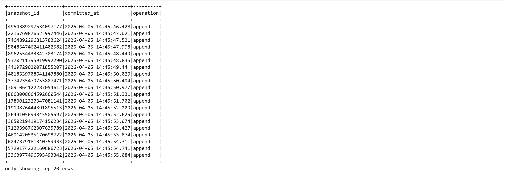
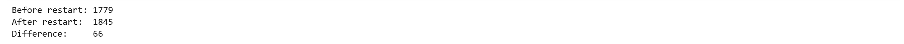
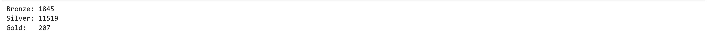
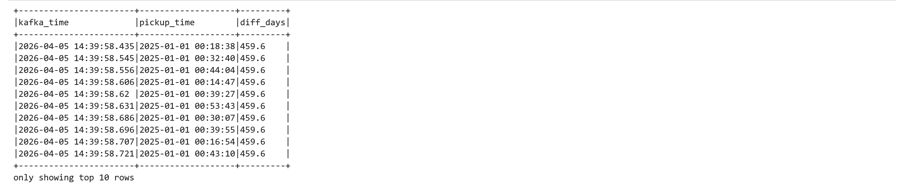

# Project 2: Streaming Lakehouse Pipeline

## 1. Medallion layer schemas

### Bronze

**Table:** `lakehouse.taxi.bronze`

| Column          | Type      | Description                                          |
|-----------------|-----------|------------------------------------------------------|
| kafka_time      | timestamp | Kafka message timestamp (CreateTime set by producer) |
| value           | string    | Raw JSON payload of the taxi trip event              |
| kafka_partition | integer   | Kafka partition the message was consumed from        |
| kafka_offset    | long      | Kafka offset within the partition                    |

Bronze stores every message exactly as received from Kafka with no parsing, no type casting, and no filtering. The raw JSON is kept in `value` so that no information is lost and the original event can always be reconstructed. `kafka_time` is captured from Kafka metadata to preserve the transport-layer timestamp separately from the application event time inside the payload.

### Silver

**Table:** `lakehouse.taxi.silver`

| Column               | Type      | Description                                         |
|----------------------|-----------|-----------------------------------------------------|
| pickup_time          | timestamp | Parsed tpep_pickup_datetime (event time)            |
| dropoff_time         | timestamp | Parsed tpep_dropoff_datetime                        |
| vendor_id            | integer   | Taxi vendor (1 or 2)                                |
| passenger_count      | integer   | Number of passengers (null in source for many rows) |
| trip_distance        | double    | Trip distance in miles                              |
| pu_location_id       | integer   | Pickup zone ID                                      |
| do_location_id       | integer   | Dropoff zone ID                                     |
| fare_amount          | double    | Base fare in USD                                    |
| tip_amount           | double    | Tip in USD                                          |
| total_amount         | double    | Total charge in USD                                 |
| payment_type         | integer   | 1=Credit, 2=Cash, 3=No charge, 4=Dispute           |
| congestion_surcharge | double    | NYC congestion surcharge                            |
| pu_zone              | string    | Pickup zone name (joined from zone lookup)          |
| do_zone              | string    | Dropoff zone name (joined from zone lookup)         |
| kafka_time           | timestamp | Kafka message timestamp carried from Bronze         |

Silver parses the raw JSON from Bronze, casts all fields to their correct types, applies cleaning rules, and enriches with human-readable zone names. Every column is typed and named, so Silver is directly queryable without any JSON handling. The zone join means analysts never need to cross-reference the lookup table manually.

### Gold

**Table:** `lakehouse.taxi.gold`

| Column            | Type      | Description                                     |
|-------------------|-----------|-------------------------------------------------|
| pickup_date       | date      | Partition column, date of the pickup hour       |
| pickup_hour       | timestamp | Start of the 1-hour aggregation window          |
| pu_zone           | string    | Pickup zone name                                |
| total_trips       | long      | Number of trips in this zone-hour               |
| total_revenue     | double    | Sum of fare_amount for the zone-hour            |
| avg_fare          | double    | Average fare for the zone-hour                  |
| avg_tip           | double    | Average tip for the zone-hour                   |
| avg_trip_distance | double    | Average trip distance for the zone-hour         |

Gold aggregates data into hourly revenue and trip count summaries per pickup zone. Each row represents one zone's activity during one hour, giving business-ready metrics without requiring further computation at query time.

---

## 2. Cleaning rules and enrichment

**Rule 1: Drop null pickup_time.** Rows where `tpep_pickup_datetime` cannot be parsed to a timestamp are dropped. An unparseable datetime means the record is corrupt and cannot be used for any time-based analysis or windowing.

**Rule 2: Drop non-positive fare_amount.** Rows where `fare_amount <= 0` are dropped. Zero or negative fares indicate test records, voids, or data entry errors that do not represent real trips.

**Rule 3: Drop non-positive trip_distance.** Rows where `trip_distance <= 0` are dropped. A zero or negative distance means the vehicle did not move, which is either a sensor error or a cancelled trip.

**passenger_count: intentionally not filtered.** This field is null for the majority of January 2025 TLC records. This is a known upstream data quality issue in the source data -- the TLC stopped collecting passenger count for many vendor types in this period. Filtering on `passenger_count > 0` would discard nearly all rows, which is worse than retaining the nulls. The null values are kept and documented here so downstream consumers are aware.

**Enrichment: Zone name join.** Zone names are joined from `taxi_zone_lookup.parquet` using a broadcast join. The lookup table has around 265 rows and fits in memory on every executor, making a broadcast join the correct choice. Two separate aliases are created (`pu_zones` and `do_zones`) to avoid column ambiguity when joining on both pickup and dropoff location IDs. The join is `left` so that records with unrecognised zone IDs are retained with a null zone name rather than dropped.

---

## 3. Streaming configuration

**Checkpoint paths:** `/home/jovyan/checkpoints/bronze`, `/home/jovyan/checkpoints/silver`, `/home/jovyan/checkpoints/gold`

The checkpoint stores the last committed Kafka offset per partition in a write-ahead log. On restart, Spark reads these offsets and resumes from exactly the next unprocessed message. This overrides `startingOffsets=earliest` and is what guarantees no duplicates on restart (see Section 5).

Checkpoints are stored on the local container filesystem rather than MinIO because the `pyspark-notebook` image does not bundle the `hadoop-aws` jar required for `s3a://` paths. In production the checkpoints would live in object storage for durability across container restarts.

**Trigger:** default (continuous micro-batch). No explicit trigger interval is set. Spark processes each available Kafka micro-batch as fast as possible. This is appropriate for all three layers -- Bronze and Silver have no aggregation so there is no reason to slow them down, and Gold's windows are bounded by the watermark rather than the trigger interval.

**Output mode:** `append` for all three layers. Iceberg only supports `append` for streaming writes -- `complete` and `update` are not supported. For Bronze and Silver this is semantically correct since both layers only ever add new rows. For Gold, `append` works correctly in combination with the watermark: Spark holds window state in memory until the watermark passes the window's end, then emits the finalised result as a single append. This ensures each window is written exactly once and never partially updated.

**Watermark:** 10 minutes on `pickup_time` at the Gold layer only. This tells Spark to wait up to 10 minutes past a window's end before finalising and emitting that window's aggregation result. It also bounds the amount of state held in memory by discarding windows older than the threshold. Bronze and Silver do not use a watermark because they perform no aggregation.

---

## 4. Gold table partitioning strategy

Gold is partitioned by `pickup_date` (DATE), derived from the start of each 1-hour pickup window. This optimises the most natural query pattern for this table: filtering by day. With date partitioning, Spark can skip all other partitions and scan only the relevant day's data files rather than doing a full table scan.

Hourly granularity within each partition means each day contains approximately 24 multiplied by the number of active zones rows, which is a manageable partition size that avoids both small-file problems and oversized files.

Iceberg's built-in `days(pickup_hour)` transform was attempted but is incompatible with Spark 4.x streaming in `append` mode in this environment. A plain DATE column partition achieves the same physical layout with full compatibility.

**Iceberg snapshot history:**



Each snapshot corresponds to one micro-batch written by the Gold streaming query. All operations are `append`, consistent with the output mode and watermark-based window finalisation.

---

## 5. Restart proof

The Bronze streaming query was stopped and immediately restarted from the same checkpoint while the producer continued running at 100 events per second.



The 66 additional rows represent new messages produced during the roughly 10 second restart window (100 ev/s multiplied by the effective downtime). Zero rows were duplicated. On restart, Spark read the committed Kafka offsets from the checkpoint and resumed from exactly offset N+1 per partition. `startingOffsets=earliest` was overridden by the checkpoint so Spark did not re-read messages from the beginning of the topic.

**Final pipeline row counts:**



Silver and Gold have more rows than Bronze because they read from Kafka independently using their own consumer groups and checkpoints. By the time Silver and Gold started consuming, the producer had already written significantly more messages to the topic than Bronze had processed at the time of the idempotency count.

---

## 6. Custom scenario

### Modification to produce.py

`producer.send()` was extended with a `timestamp_ms` parameter set to current wall-clock time minus 5 minutes for every message:

```python
producer.send(
    args.topic,
    key=key,
    value=msg,
    timestamp_ms=int(time.time() * 1000) - (5 * 60 * 1000),
)
```

This is computed per message inside the loop so every event gets an accurate offset relative to its actual send time.

### Query: kafka_time vs tpep_pickup_datetime



`kafka_time` is April 2026 (current ingestion time minus 5 minutes). `pickup_time` is January 2025 (the actual trip event time embedded in the payload). The gap is approximately 459 days. They are completely independent values that serve entirely different purposes.

### CreateTime vs LogAppendTime

Kafka supports two timestamp modes per topic, controlled by `message.timestamp.type`:

**CreateTime** (default): the timestamp is set by the producer at the moment the message is created. The broker stores and forwards it unchanged. This is what `timestamp_ms` in `producer.send()` controls. The producer has full authority over this value and can set it to any time, including the past, as demonstrated here.

**LogAppendTime**: the broker overwrites the producer-supplied timestamp with its own wall-clock time at the moment the message is appended to the partition log. The producer-supplied value is discarded entirely, making the timestamp reflect ingestion time rather than event time.

**This setup uses CreateTime.** The topic was created without setting `message.timestamp.type`, which defaults to `CreateTime`. This is confirmed by the query output: `kafka_time` reflects the producer-supplied offset of current time minus 5 minutes, not the broker's append time. If LogAppendTime were active, the `timestamp_ms` parameter would have no effect.

The practical implication is that `kafka_time` cannot be trusted as a reliable event timestamp unless all producers set it correctly. For time-based windowing in Silver and Gold, `tpep_pickup_datetime` from the payload is used instead, as it represents the true application event time.

---

## 7. How to run

```bash
# Step 1: Copy env file and set credentials
cp .env.example .env
# Edit .env with the values listed below

# Step 2: Start infrastructure
docker compose up -d

# Step 3: Verify all services are healthy
docker ps
# kafka, minio, minio_init (exited), iceberg-rest, jupyter should all appear

# Step 4: Create the Kafka topic (once only)
docker exec kafka sh -c "/opt/kafka/bin/kafka-topics.sh \
  --bootstrap-server localhost:9092 \
  --create --topic taxi-trips --partitions 3 --replication-factor 1"

# Step 5: Open a Jupyter terminal and start the producer
cd ~/project
python produce.py --rate 100 --loop

# Step 6: Open Jupyter at http://localhost:8888 and run notebook cells 1-13 in order
```

**Service URLs:**

| Service       | URL                                  |
|---------------|--------------------------------------|
| Jupyter       | http://localhost:8888                |
| Spark UI      | http://localhost:4040                |
| MinIO Console | http://localhost:9001                |
| Iceberg REST  | http://localhost:8181/v1/namespaces  |

**.env values for grader:**

```
MINIO_ROOT_USER=adminuser
MINIO_ROOT_PASSWORD=password123
JUPYTER_TOKEN=mytoken123
```
