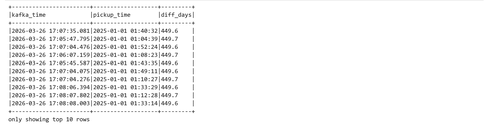

# Project 2: Streaming Lakehouse Pipeline

## 1. Medallion layer schemas

### Bronze

**Table:** `lakehouse.taxi.bronze`

| Column          | Type      | Description                                           |
|-----------------|-----------|-------------------------------------------------------|
| kafka_time      | timestamp | Kafka message timestamp (CreateTime set by producer)  |
| value           | string    | Raw JSON payload of the taxi trip event               |
| kafka_partition | integer   | Kafka partition the message was consumed from         |
| kafka_offset    | long      | Kafka offset within the partition                     |

Bronze stores every message exactly as received from Kafka — no parsing, no type casting, no filtering. The raw JSON is preserved in `value` so that no information is lost and the original event can always be reconstructed. `kafka_time` is captured from Kafka metadata rather than the payload to preserve the transport-layer timestamp independently of application-level event time. This separation is intentional and is explored in Section 6.

### Silver

_Table DDL or DataFrame schema. Explain what changed compared to bronze and why._

### Gold

_Table DDL or DataFrame schema. Explain the aggregation logic._

---

## 2. Cleaning rules and enrichment

_List each cleaning rule (nulls, invalid values, deduplication key) with a brief justification._
_Describe the enrichment step (zone lookup join)._

---

## 3. Streaming configuration

**Checkpoint path:** `/home/jovyan/checkpoints/bronze`

The checkpoint stores the last committed Kafka offset per partition in a write-ahead log. On restart, Spark reads these offsets and resumes consumption from exactly the next unprocessed message — `startingOffsets` is overridden by the checkpoint once it exists. This is the mechanism that guarantees no duplicates on restart (see Section 5).

The checkpoint is stored on local filesystem rather than MinIO because the `pyspark-notebook` Docker image does not bundle the `hadoop-aws` jar required for `s3a://` paths. In production the checkpoint would be written to `s3a://warehouse/checkpoints/bronze` for durability across container recreation.

**Trigger:** default (continuous micro-batch)

No explicit trigger interval is set. Spark processes each available Kafka micro-batch immediately. This is appropriate for Bronze since the goal is low-latency ingestion with no aggregation — there is no benefit to artificially slowing the write rate.

**Output mode:** `append`

Bronze only ever adds new rows — it never updates or deletes existing ones. `append` is the correct and only valid output mode for a raw ingestion layer with no aggregations.

**Watermark:** none

Bronze stores raw events without any time-based aggregation or deduplication. Watermarking is not needed at this layer. It is applied in Silver where windowed aggregations over `tpep_pickup_datetime` require late data handling.

---

## 4. Gold table partitioning strategy

_Explain your partitioning choice. Why this column(s)? What query patterns does it optimize?_
_Show the Iceberg snapshot history (query output or screenshot)._

---

## 5. Restart proof

The bronze streaming query was stopped and restarted from the same checkpoint while the producer continued running.

| Measurement   | Row count |
|---------------|-----------|
| Before stop   | 14,922    |
| After restart | 14,993    |
| Difference    | +71       |

The 71 additional rows are new messages produced during the ~10 seconds the job was stopped (producer running at ~5 ev/s). Zero rows were duplicated.

On restart, Spark read the committed Kafka offsets from the checkpoint and resumed from exactly offset N+1 per partition. The `startingOffsets=earliest` option in the reader was overridden by the checkpoint, so Spark did not re-read messages from the beginning of the topic.

---

## 6. Custom scenario

### Modification to produce.py

`producer.send()` was extended with a `timestamp_ms` parameter set to current wall-clock time minus 5 minutes for every message:

```python
producer.send(
    args.topic,
    key=key,
    value=msg,
    timestamp_ms=int(time.time() * 1000) - (5 * 60 * 1000),
)
```

This value is computed per message inside the loop so every event receives an accurate offset relative to its actual send time.

### Query: kafka_time vs tpep_pickup_datetime

```python
spark.read.table("lakehouse.taxi.bronze") \
    .withColumn("payload", from_json(col("value"), payload_schema)) \
    .withColumn("pickup_time", col("payload.tpep_pickup_datetime").cast("timestamp")) \
    .select(
        col("kafka_time"),
        col("pickup_time"),
        round((unix_timestamp("kafka_time") - unix_timestamp("pickup_time")) / 86400, 1).alias("diff_days")
    ).show(10, truncate=False)
```

**Output:**





`kafka_time` is March 2026 (current ingestion time minus 5 minutes). `pickup_time` is January 2025 (the actual trip event time). The gap is ~449 days — they are completely independent values.

### CreateTime vs LogAppendTime

Kafka supports two timestamp modes per topic, controlled by `message.timestamp.type`:

**CreateTime** (default): the timestamp is set by the producer at the moment the message is created. The broker stores and forwards it unchanged. This is what `timestamp_ms` in `producer.send()` controls. The producer has full authority over this value — it can be set to any time, including the past, as demonstrated here.

**LogAppendTime**: the broker overwrites the producer-supplied timestamp with the wall-clock time at the moment the message is written to the partition log. The producer has no control over this value.

**This setup uses CreateTime.** The topic was created without setting `message.timestamp.type`, which defaults to `CreateTime`. This is confirmed by the query output: `kafka_time` reflects the producer-supplied offset (current time minus 5 minutes), not the broker's append time.

The practical implication: `kafka_time` cannot be trusted as a reliable ingestion timestamp in production unless CreateTime is set correctly by all producers. For time-based windowing in the Silver layer, `tpep_pickup_datetime` from the payload — the true application event time — must be used instead.

---

## 7. How to run

```bash
# Step 1: Start infrastructure
docker compose up -d

# Step 2: Verify all services are healthy
docker ps

# Step 3: Create the Kafka topic (once only)
docker exec kafka sh -c "/opt/kafka/bin/kafka-topics.sh \
  --bootstrap-server localhost:9092 \
  --create --topic taxi-trips --partitions 3 --replication-factor 1"

# Step 4: Start the producer (Jupyter terminal)
python project/produce.py --rate 100 --loop

# Step 5: Open Jupyter at http://localhost:8888 and run the notebook cells in order
```

**Service URLs:**

| Service       | URL                                  |
|---------------|--------------------------------------|
| Jupyter       | http://localhost:8888                |
| Spark UI      | http://localhost:4040                |
| MinIO Console | http://localhost:9001                |
| Iceberg REST  | http://localhost:8181/v1/namespaces  |

**.env values for grader:**

```
MINIO_ROOT_USER=adminuser
MINIO_ROOT_PASSWORD=password123
JUPYTER_TOKEN=mytoken123
```
