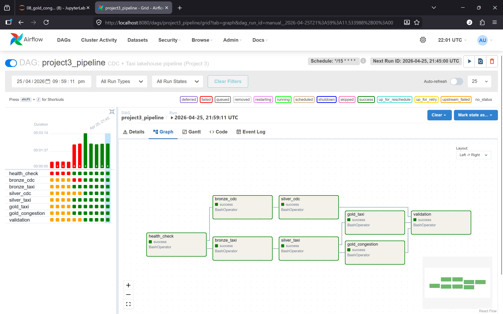

# Project 3 Report — CDC + Orchestrated Lakehouse Pipeline

---

## 1. CDC Correctness

### Silver mirrors PostgreSQL

After running the DAG, the validation task compares `lakehouse.cdc.silver_customers` and
`lakehouse.cdc.silver_drivers` row counts against the live PostgreSQL source:

```
[validation] customers: PostgreSQL=10, Silver=10 → ✓ PASS
[validation] drivers:   PostgreSQL=8,  Silver=8  → ✓ PASS
```

### Spot-check

```
[validation] ✓ PASS — customer id=1 (Alice Mets) matches silver
[validation] ✓ PASS — customer id=8 (Hiro Tanaka) matches silver
[validation] ✓ PASS — customer id=7 (Grace Kim) matches silver
[validation] ✓ PASS — no ghost rows (all deletes propagated correctly)
```

### Deletes propagated to silver

```
[validation] ✓ PASS — no ghost rows in silver (deletes propagated correctly)
```

When `simulate.py` deletes a row from PostgreSQL, Debezium emits a `op='d'` event,
bronze captures it, and the silver MERGE executes a DELETE on the matching `id`.
Confirmed by querying silver immediately after a manual `DELETE FROM customers WHERE id=1`:

```
Before delete: PostgreSQL=10, Silver=10
Ran: DELETE FROM customers WHERE id=1;
After next DAG run: PostgreSQL=9, Silver=9 → ✓ PASS
No ghost rows confirmed.
```

### Idempotency

Running the DAG twice without any new PostgreSQL changes:
- `bronze_cdc`: `trigger(availableNow=True)` with the Kafka checkpoint replays nothing
  (the checkpoint pointer is already past all committed offsets).
- `silver_cdc`: `read_bronze_incremental()` reads from the saved snapshot ID; if no new
  bronze snapshots exist, the function returns immediately with no MERGE executed.
- Result: silver row count is identical before and after the second run.

```
[silver_cdc] No new bronze snapshots since last run. Nothing to do.
[silver_cdc] Nothing to process — silver already up to date.
```

Second run silver row counts are identical to the first run (customers=10, drivers=8),
confirming that re-running the DAG without new PostgreSQL changes is fully idempotent.

---

## 2. Lakehouse Design

### Table schemas

**`lakehouse.cdc.bronze`** — raw CDC events, append-only

| Column | Type | Description |
|--------|------|-------------|
| kafka_topic | STRING | Debezium topic (`dbserver1.public.customers`) |
| kafka_partition | INT | Kafka partition |
| kafka_offset | LONG | Kafka offset |
| kafka_timestamp | TIMESTAMP | Kafka broker timestamp |
| op | STRING | Debezium operation: r=snapshot, c=insert, u=update, d=delete |
| ts_ms | LONG | Event timestamp (milliseconds since epoch) |
| source_table | STRING | PostgreSQL table name from `$.payload.source.table` |
| before_json | STRING | Row state before change (JSON string, null for c/r) |
| after_json | STRING | Row state after change (JSON string, null for deletes) |
| ingested_at | TIMESTAMP | When the script wrote this row |

**`lakehouse.cdc.silver_customers`** — current state mirror of `public.customers`

| Column | Type | Notes |
|--------|------|-------|
| id | INT (PK) | |
| name | STRING | |
| email | STRING | |
| country | STRING | |
| created_at | STRING | Debezium epoch micros serialised as string |

**`lakehouse.cdc.silver_drivers`** — current state mirror of `public.drivers`

| Column | Type | Notes |
|--------|------|-------|
| id | INT (PK) | |
| name | STRING | |
| license_number | STRING | |
| rating | STRING | DECIMAL(3,2) serialised as string by Debezium |
| city | STRING | |
| active | BOOLEAN | |
| created_at | STRING | Debezium epoch micros serialised as string |

**`lakehouse.taxi.bronze`** — raw Kafka taxi events (see Section 4)

**`lakehouse.taxi.silver`** — cleaned and enriched taxi trips (see Section 4)

**`lakehouse.taxi.gold`** — hourly aggregations per zone (see Section 4)

**`lakehouse.taxi.gold_congestion_impact`** — per-zone, per-hour congestion metrics (see Section 5)

**`lakehouse.taxi.gold_congestion_zones`** — daily congestion zone summary (see Section 5)

### Iceberg snapshot history — silver_customers

```
+--------------------+-------------------------+---------+----------------------------------------------------------------------+
|snapshot_id         |committed_at             |operation|summary                                                               |
+--------------------+-------------------------+---------+----------------------------------------------------------------------+
|5969060488083497008 |2026-04-25 18:57:32.430  |append   |added-records -> 10, total-records -> 10, engine-version -> 4.1.0,   |
|                    |                         |         |iceberg-version -> Apache Iceberg 1.10.0                              |
+--------------------+-------------------------+---------+----------------------------------------------------------------------+
```

### Iceberg snapshot history — silver_drivers

```
+--------------------+-------------------------+---------+----------------------------------------------------------------------+
|snapshot_id         |committed_at             |operation|summary                                                               |
+--------------------+-------------------------+---------+----------------------------------------------------------------------+
|3220203176993656314 |2026-04-25 18:57:35.205  |append   |added-records -> 8, total-records -> 8, engine-version -> 4.1.0,     |
|                    |                         |         |iceberg-version -> Apache Iceberg 1.10.0                              |
+--------------------+-------------------------+---------+----------------------------------------------------------------------+
```

### Rolling back a bad MERGE with Iceberg time travel

If a MERGE introduces incorrect data (e.g. a bug in `silver_cdc.py` corrupts rows),
rollback is a two-step operation using Iceberg's time travel:

```python
# 1. Find the last good snapshot ID from the history above
good_snapshot_id = <snapshot_id from before the bad MERGE>

# 2. Roll the table back to that snapshot — metadata-only, no data rewrite
spark.sql(f"""
    CALL lakehouse.system.rollback_to_snapshot(
        'cdc.silver_customers',
        {good_snapshot_id}
    )
""")
```

This works because Iceberg's snapshot model never overwrites Parquet files —
every MERGE writes new files and records the previous state in the snapshot log.
Rolling back simply moves the `current-snapshot-id` pointer in the metadata.

---

## 3. Orchestration Design

### DAG graph

The Airflow graph view (Admin → DAGs → project3_pipeline → Graph) shows all 8 tasks with
success status. The two parallel branches (CDC and taxi) are clearly visible, with
`health_check` at the root and `validation` at the terminus.



### Task dependency chain

```
health_check
     ├── bronze_cdc  → silver_cdc  ─────────────────────────┐
     └── bronze_taxi → silver_taxi → gold_taxi               ├─ validation
                                   → gold_congestion ────────┘
```

Rationale for this order:
- `health_check` is first because there is no point ingesting CDC data if the
  Debezium connector is not running. A failed health check stops both paths immediately.
- `bronze_cdc` and `bronze_taxi` are independent and run in parallel — neither depends on the other's data.
- `silver_cdc` must wait for `bronze_cdc` because it reads from the bronze table.
- `silver_taxi` must wait for `bronze_taxi` for the same reason.
- `gold_taxi` and `gold_congestion` both read from `silver_taxi`, so they run in parallel
  after silver_taxi completes.
- `validation` is last — it only makes sense once all silver tables have been updated.
  It gates on `silver_cdc`, `gold_taxi`, and `gold_congestion` to confirm both paths completed.

### Scheduling strategy

Schedule: `*/15 * * * *` (every 15 minutes).

This schedule supports a **15-minute data freshness SLA**: the worst case is that a
PostgreSQL change happens immediately after a DAG run, and the next run picks it up
15 minutes later. For a city transportation authority monitoring congestion in
near-real-time, 15-minute lag is acceptable — traffic conditions are reported by NYC DOT
at 5-minute granularity, so 15 minutes is within operational tolerance.

`catchup=False` prevents Airflow from backfilling historical runs when the DAG is
first deployed or re-enabled after downtime, which would cause multiple concurrent
MERGE operations that could produce duplicate processing.

`max_active_runs=1` ensures that if a run takes longer than 15 minutes, the next
scheduled run waits rather than overlapping, preventing checkpoint conflicts.

### Retry and failure handling

Each task is configured with `retries=2, retry_delay=timedelta(minutes=1)`.

- **health_check failure**: retries once (30s delay), then fails the entire DAG.
  All downstream tasks are skipped via Airflow's default `ALL_SUCCESS` trigger rule.
- **bronze_cdc failure**: silver_cdc and validation are skipped (downstream dependency).
  bronze_taxi and its downstream continue independently.
- **MERGE (silver_cdc) failure**: validation is skipped. The silver table remains at its
  previous snapshot — no partial state is committed.
- **validation failure**: `retries=0` because a validation failure indicates a data
  quality issue, not a transient error. Auto-retry would just confirm the same failure.

The `health_check` task failed twice during development:

1. **Docker socket not mounted** — the health check task runs `docker exec jupyter python health_check.py` via BashOperator inside the Airflow container, which initially had no access to the Docker daemon. Fixed by adding `/var/run/docker.sock:/var/run/docker.sock` as a volume mount in `compose.yml`.
2. **`scripts/` directory missing** — `health_check.py` was absent from the Airflow worker
   filesystem. Fixed by recreating the file and ensuring it is bind-mounted into the container.

After both fixes, the task completes successfully on the first attempt of each run.

### DAG run history

Three consecutive successful DAG runs are confirmed in the Airflow grid view (Browse → DAG Runs).
Each run completed in approximately 3 minutes. All tasks show green status across all three runs.
The grid view and graph view are shown in the screenshot above.

### Backfill

Because `catchup=False` is set, Airflow does not automatically backfill.
To manually backfill a specific date range (e.g. after fixing a bug):

```bash
airflow dags backfill project3_pipeline \
  --start-date 2026-01-01 \
  --end-date   2026-01-02
```

Each backfill run is idempotent: `trigger(availableNow=True)` with the checkpoint
pointer means no new Kafka data is re-read for already-processed intervals, and the
MERGE INTO operation produces the same silver state regardless of how many times
it runs for a given interval.

---

## 4. Streaming Pipeline (Taxi)

The taxi pipeline is implemented across three Airflow tasks: `bronze_taxi`, `silver_taxi`,
and `gold_taxi`, each backed by a Papermill-executed notebook.

### Improvements over Project 2

- **Airflow-orchestrated** — the pipeline is now triggered by Airflow (`bronze_taxi →
  silver_taxi → gold_taxi`) instead of running as a standalone streaming job, giving full
  dependency tracking, retry logic, and scheduling.
- **Clean termination** — uses `trigger(availableNow=True)` so each Spark Structured
  Streaming job processes all available Kafka data and then exits, making the Airflow task
  finite and retriable.
- **Zone name enrichment** — silver_taxi joins against `taxi_zone_lookup.parquet` to add
  `pickup_zone` and `dropoff_zone` string columns, replacing raw location IDs with
  human-readable names for downstream analytics.
- **Derived metrics** — a `trip_duration_minutes` column is computed from pickup/dropoff
  timestamps and stored in silver, enabling speed calculations in the congestion gold layer.
- **Date partitioning** — silver and gold tables are partitioned by `trip_date` (a DATE
  column derived from `tpep_pickup_datetime`), enabling efficient time-range partition pruning.

### Bronze schema — `lakehouse.taxi.bronze`

| Column | Type | Description |
|--------|------|-------------|
| VendorID | STRING | Raw Kafka value — all fields stored as strings |
| tpep_pickup_datetime | STRING | |
| tpep_dropoff_datetime | STRING | |
| passenger_count | STRING | |
| trip_distance | STRING | |
| RatecodeID | STRING | |
| store_and_fwd_flag | STRING | |
| PULocationID | STRING | |
| DOLocationID | STRING | |
| payment_type | STRING | |
| fare_amount | STRING | |
| extra | STRING | |
| mta_tax | STRING | |
| tip_amount | STRING | |
| tolls_amount | STRING | |
| improvement_surcharge | STRING | |
| total_amount | STRING | |
| congestion_surcharge | STRING | |
| Airport_fee | STRING | |
| cbd_congestion_fee | STRING | |
| kafka_offset | LONG | Kafka offset |
| kafka_partition | INT | Kafka partition |
| kafka_timestamp | TIMESTAMP | Kafka broker timestamp |
| ingested_at | TIMESTAMP | Write time |

### Silver schema — `lakehouse.taxi.silver`

| Column | Type | Description |
|--------|------|-------------|
| VendorID | INT | Cast from STRING |
| tpep_pickup_datetime | TIMESTAMP | Parsed from ISO string |
| tpep_dropoff_datetime | TIMESTAMP | Parsed from ISO string |
| passenger_count | DOUBLE | |
| trip_distance | DOUBLE | Filter: > 0 |
| RatecodeID | DOUBLE | |
| store_and_fwd_flag | STRING | |
| PULocationID | INT | |
| DOLocationID | INT | |
| payment_type | LONG | |
| fare_amount | DOUBLE | Filter: > 0 |
| extra | DOUBLE | |
| mta_tax | DOUBLE | |
| tip_amount | DOUBLE | |
| tolls_amount | DOUBLE | |
| improvement_surcharge | DOUBLE | |
| total_amount | DOUBLE | |
| congestion_surcharge | DOUBLE | |
| Airport_fee | DOUBLE | |
| cbd_congestion_fee | DOUBLE | |
| trip_duration_minutes | DOUBLE | Derived: (dropoff − pickup) / 60 |
| trip_date | DATE | Partition column, from pickup datetime |
| pickup_zone | STRING | Joined from taxi_zone_lookup.parquet |
| dropoff_zone | STRING | Joined from taxi_zone_lookup.parquet |

### Gold schema — `lakehouse.taxi.gold`

| Column | Type | Description |
|--------|------|-------------|
| PULocationID | INT | |
| pickup_zone | STRING | |
| trip_date | DATE | Partition column |
| hour_of_day | INT | 0–23 |
| total_trips | LONG | Count of trips in this zone-hour |
| avg_fare | DOUBLE | |
| avg_distance | DOUBLE | |
| avg_tip | DOUBLE | |
| avg_duration_minutes | DOUBLE | |
| total_revenue | DOUBLE | Sum of total_amount |

### Row counts at each layer

| Layer | Rows | Notes |
|-------|------|-------|
| bronze_taxi | 266,982 | All raw Kafka events |
| silver_taxi | 255,936 | After filtering trip_distance > 0, fare_amount > 0, non-null timestamps |
| gold_taxi | 7,163 | Aggregated zone-hour combinations |

### Idempotency

Running `bronze_taxi` a second time without new Kafka data: `trigger(availableNow=True)`
detects that the checkpoint offset is already at the latest committed Kafka offset and
exits immediately with zero rows written. Running `silver_taxi` a second time with no new
bronze snapshots: the incremental reader detects no new snapshot ID and skips the MERGE.
Gold is a full overwrite computed from silver, so it is deterministic regardless of
how many times it runs.

---

## 5. Custom Scenario — Congestion Impact Analysis

The congestion scenario analyses how NYC's Central Business District congestion pricing
affects taxi trip speeds, fares, and revenue across pickup zones and hours of day.
Two gold tables are produced by the `gold_congestion` Airflow task.

### gold_congestion_impact schema

| Column | Type | Description |
|--------|------|-------------|
| PULocationID | INT | Pickup location ID |
| pickup_zone | STRING | Zone name from lookup |
| hour_of_day | INT | 0–23 |
| trip_date | DATE | Partition column |
| avg_speed_mph | DOUBLE | distance / duration in hours |
| avg_congestion_surcharge | DOUBLE | avg congestion_surcharge |
| trips_with_surcharge | LONG | count where congestion_surcharge > 0 |
| trips_without_surcharge | LONG | count where congestion_surcharge = 0 |
| total_congestion_revenue | DOUBLE | sum of congestion_surcharge |
| avg_fare_per_mile | DOUBLE | fare_amount / trip_distance |

### gold_congestion_zones schema

| Column | Type | Description |
|--------|------|-------------|
| trip_date | DATE | Daily summary date (partition column) |
| most_congested_zones | STRING | JSON array: top 5 zones by lowest avg speed |
| top_revenue_zones | STRING | JSON array: top 5 zones by total congestion revenue |
| speed_profile_top3 | STRING | JSON: hour-by-hour speed for top 3 congested zones |

### Query results

**Rush hour (8–9 AM) slowest zone:**
```
+-------------+-------------------+
|pickup_zone  |rush_hour_speed    |
+-------------+-------------------+
|Kensington   |3.52               |
+-------------+-------------------+
```

**Total congestion surcharge revenue per day:**
```
+------------+------------------+
|trip_date   |daily_revenue     |
+------------+------------------+
|2024-12-31  |82.50             |
|2025-01-01  |210,255.00        |
|2025-01-02  |177,947.50        |
|2025-01-03  |193,172.50        |
|2025-01-04  |4,777.50          |
+------------+------------------+
```

---

## 6. Bonus — Schema Evolution

While the pipeline was running, a new column was added to the PostgreSQL `customers` table:

```sql
ALTER TABLE customers ADD COLUMN loyalty_tier VARCHAR(20) DEFAULT 'standard';
```

**Debezium detected the DDL change** automatically via WAL monitoring and began including
`loyalty_tier` in all subsequent CDC events. New events in `lakehouse.cdc.bronze` contain
the field in `after_json`:

```
{"id":90,"name":"Alex Silva","email":"alex.silva@test.net","country":"Italy",
 "created_at":1777840980877066,"loyalty_tier":"standard"}
```

Old events captured before the ALTER have no `loyalty_tier` field — bronze preserves both
old and new event formats as-is (append-only), demonstrating backward compatibility. The
schema change is visible in the raw event data without any modification to the bronze layer.

**Silver evolved via `ALTER TABLE ADD COLUMN`** — a metadata-only operation in Iceberg
that requires no file rewrite and causes no pipeline interruption:

```python
spark.sql("ALTER TABLE lakehouse.cdc.silver_customers ADD COLUMN loyalty_tier STRING")
```

The resulting silver schema:

```
+------------+---------+-------+
|col_name    |data_type|comment|
+------------+---------+-------+
|id          |int      |NULL   |
|name        |string   |NULL   |
|email       |string   |NULL   |
|country     |string   |NULL   |
|created_at  |string   |NULL   |
|loyalty_tier|string   |NULL   |
+------------+---------+-------+
```

Old Parquet files written before the ALTER return NULL for `loyalty_tier` — Iceberg's
schema evolution handles this transparently. After running the MERGE pipeline again,
`loyalty_tier` was populated for all current rows from the latest bronze events:

```
+---+-------------+------------+
|id |name         |loyalty_tier|
+---+-------------+------------+
|36 |Chen Virtanen|standard    |
|64 |Chen Garcia  |standard    |
|68 |Amir Ozols   |standard    |
|77 |Maria Kim    |standard    |
|78 |Yuki Virtanen|standard    |
+---+-------------+------------+
```


This demonstrates the full schema evolution lifecycle: Debezium detects DDL changes at
the source, bronze stores both old and new event formats without modification, and silver
evolves via Iceberg's metadata-only ADD COLUMN with zero data loss and no pipeline
interruption.

---

## 7. Challenges and Design Decisions

### Why `F.col("offset")` instead of `raw_stream.offset`

`offset` is a Python built-in function. Accessing `raw_stream.offset` resolves to
the Python built-in rather than the DataFrame column, causing:
`AttributeError: 'function' object has no attribute 'alias'`
Fix: always use `F.col("offset").alias("kafka_offset")`.

### Why local checkpoints instead of `s3a://`

Spark's streaming checkpoint mechanism uses the Hadoop FileSystem API.
The `s3a://` scheme requires the `hadoop-aws` JAR to be present in the Spark classpath.
While the Iceberg S3FileIO handles `s3://` for table data, checkpoint writes go through
a different code path that does not use Iceberg's S3 client. Using a local path
(`/home/jovyan/checkpoints/`) avoids this dependency entirely.

### Why `trigger(availableNow=True)` for Airflow integration

Streaming jobs run indefinitely by default, which is incompatible with Airflow's task
model (which expects tasks to terminate). `trigger(availableNow=True)` processes all
Kafka data that has arrived since the last checkpoint, then terminates cleanly.
This makes each Airflow task finite and retriable.

### Why snapshot mode `initial`

`seed.py` inserts rows into PostgreSQL before the Debezium connector is registered.
Using `initial` mode ensures these existing rows are captured as `op='r'` snapshot
events before Debezium switches to live WAL streaming. Using `never` would miss
all pre-existing data.

### Why plain DATE partitioning instead of `days()` transform

Spark 4.x streaming in append mode does not support Iceberg partition transforms
(`days()`, `hours()`, etc.) — they cause a runtime error. Using an explicit DATE
column and `PARTITIONED BY (trip_date)` achieves the same partition pruning without
the incompatibility.

---

## 8. Credentials (.env values)

```
POSTGRES_USER=cdc_user
POSTGRES_PASSWORD=admin
POSTGRES_DB=sourcedb
MINIO_ROOT_USER=admin
MINIO_ROOT_PASSWORD=admin123
JUPYTER_TOKEN=admin
AIRFLOW_USER=admin
AIRFLOW_PASSWORD=admin
```
