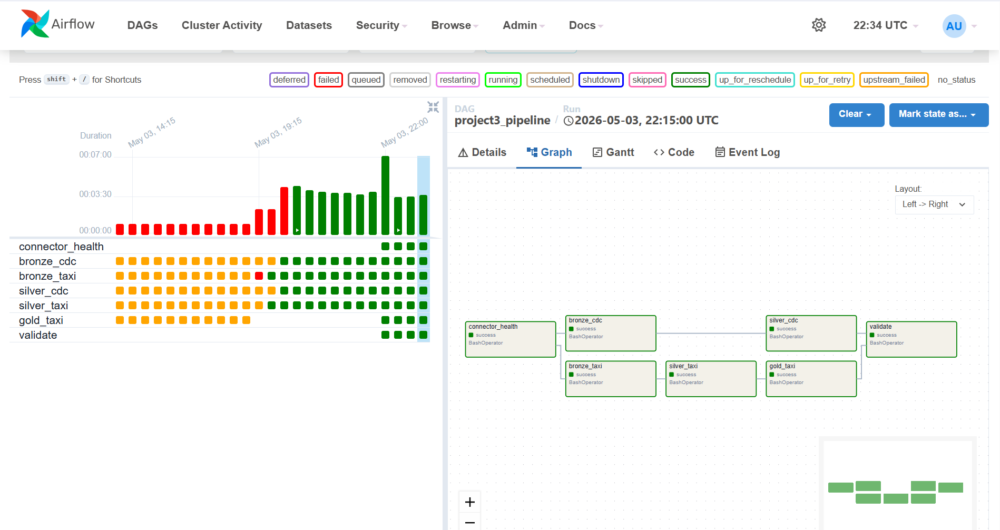
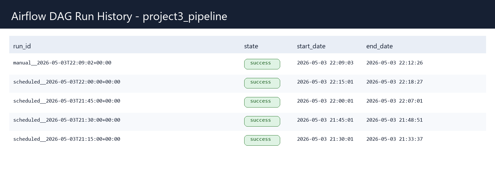
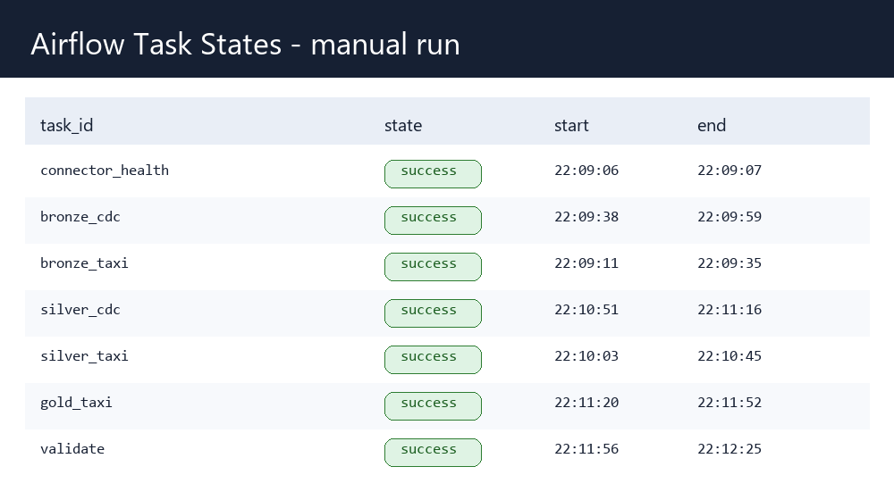

# Project 3 Report - CDC + Orchestrated Lakehouse Pipeline

## 1. CDC Correctness

The pipeline captures PostgreSQL changes from `public.customers` and `public.drivers` with Debezium, stores the raw event log in Iceberg Bronze, then materializes current state in Silver with `MERGE INTO`.

Validation after the latest Airflow run:

```text
PostgreSQL customers: 10     Silver customers: 10
PostgreSQL drivers:   8      Silver drivers:   8
```

The validation notebook also spot-checks three random customer rows by `id`, `name`, and `email`, and verifies there are no "ghost" customer IDs in Silver that are absent from PostgreSQL. The final validation task passed in the Airflow run `manual__2026-05-03T22:09:02+00:00`.

Bronze CDC contains initial snapshot events from Debezium. The current table also includes older development rows from the previous `cdc` topic prefix, but the submitted connector now uses the required `dbserver1` prefix:

```text
cdc.public.customers          r  10
cdc.public.drivers            r   8
dbserver1.public.customers    r  10
dbserver1.public.drivers      r   8
```

Deletes are handled by Debezium `op='d'` events. Bronze stores `before_json`, `after_json`, Kafka offset metadata, `source_lsn`, and `is_tombstone`. Silver uses the primary key from `before.id` for deletes and from `after.id` for inserts/updates.

Silver CDC idempotency: `silver_cdc` reads only Bronze snapshots after the saved snapshot id. If no new Bronze snapshot exists, it exits without a merge. Re-running the DAG with no new changes preserved the Silver counts at `customers=10`, `drivers=8`.

## 2. Lakehouse Design

Bronze CDC table: `lakehouse.cdc.bronze`

Raw append-only Debezium event log with Kafka metadata:

```text
kafka_topic, kafka_partition, kafka_offset, kafka_timestamp,
op, ts_ms, source_table, source_lsn, before_json, after_json,
raw_value, is_tombstone, ingested_at
```

Silver CDC tables: `lakehouse.cdc.silver_customers`, `lakehouse.cdc.silver_drivers`

Current-state mirrors of PostgreSQL. Customers stores `id, name, email, country, created_at`; drivers stores `id, name, license_number, rating, city, active, created_at`.

Taxi Bronze: `lakehouse.taxi.bronze_trips`

Raw taxi events from the `taxi-trips` Kafka topic plus metadata:

```text
trip fields, trip_id, source_file, ingested_at,
kafka_topic, kafka_partition, kafka_offset, kafka_timestamp, raw_json
```

Taxi Silver: `lakehouse.taxi.silver_trips`

Cleans and enriches Bronze: casts timestamps/numerics, drops invalid trips, computes duration, speed, fare per mile, and joins pickup zone names from `taxi_zone_lookup.parquet`.

Taxi Gold: `lakehouse.taxi.gold_congestion_impact`, `lakehouse.taxi.gold_congestion_zones`

Gold stores per-zone/hour congestion economics and daily zone rankings for the custom scenario.

Current Iceberg table counts:

```text
lakehouse.cdc.bronze                         36
lakehouse.cdc.silver_customers               10
lakehouse.cdc.silver_drivers                  8
lakehouse.taxi.bronze_trips             7052769
lakehouse.taxi.silver_trips             6554853
lakehouse.taxi.gold_congestion_impact    189899
lakehouse.taxi.gold_congestion_zones        590
```

Silver customer snapshot history:

```text
snapshot_id           committed_at             operation
385636943797440967    2026-05-03 22:06:11.388  overwrite
7476761594735281149   2026-05-03 20:22:19.441  append
```

Iceberg time travel example:

```sql
SELECT *
FROM lakehouse.cdc.silver_customers VERSION AS OF 7476761594735281149;
```

If a bad merge is committed, rollback can be done with:

```sql
CALL lakehouse.system.rollback_to_snapshot(
  'cdc.silver_customers',
  7476761594735281149
);
```

## 3. Orchestration Design

Airflow DAG: `project3_pipeline`

Current task graph:

```text
connector_health
  |-- bronze_cdc  -> silver_cdc --|
  `-- bronze_taxi -> silver_taxi -> gold_taxi -- validate
```



`connector_health` registers or validates the Debezium connector and gates both branches. A connector failure stops downstream tasks because Airflow's default trigger rule requires upstream success. Bronze CDC and Bronze Taxi then run independently. Silver CDC waits for Bronze CDC, Silver Taxi waits for Bronze Taxi, Gold Taxi waits for Silver Taxi, and `validate` waits for both Silver CDC and Gold Taxi.

Schedule: every 15 minutes (`*/15 * * * *`). This supports a 15-minute freshness SLA: the worst-case delay is a change arriving just after one run and being picked up by the next. `catchup=False` avoids accidental historical backfills, and `max_active_runs=1` prevents overlapping merges.

Retries and failure handling: default retries are `2` with a one-minute delay; `connector_health` retries once after 30 seconds; `validate` has no retry because a validation failure indicates a data quality problem. The Airflow run history shows earlier failed runs during development, then consecutive successful runs after fixes.

Recent successful runs:

```text
manual__2026-05-03T22:09:02+00:00       success
scheduled__2026-05-03T21:45:00+00:00    success
scheduled__2026-05-03T21:30:00+00:00    success
scheduled__2026-05-03T21:15:00+00:00    success
scheduled__2026-05-03T21:00:00+00:00    success
```



The successful manual run also shows every task completed:



## 4. Taxi Pipeline

The taxi pipeline is now orchestrated by Airflow. Bronze reads finite batches from Kafka topic `taxi-trips` and anti-joins existing Iceberg offsets so reruns do not duplicate events. Silver parses and validates types, drops impossible trips, enriches pickup zones, and computes `speed_mph` and `fare_per_mile`. Gold aggregates by pickup zone and hour.

Improvement over Project 2: the taxi path is no longer a standalone Spark job. It is scheduled, retried, idempotent by Kafka offset, and integrated with CDC validation in the same DAG.

## 5. Custom Scenario - Congestion Impact

The custom issue asks for congestion economics by pickup zone and hour, plus daily summaries of most congested and highest-revenue zones. This is implemented in `07_gold_congestion.ipynb`.

`lakehouse.taxi.gold_congestion_impact` computes:

```text
pickup_date, pickup_hour, PULocationID, pickup_zone, pickup_borough,
trip_count, avg_speed_mph, avg_congestion_surcharge,
congested_trips, non_congested_trips,
total_congestion_revenue, avg_fare_per_mile,
avg_fare_amount, total_fare_revenue, avg_trip_distance, avg_duration_minutes
```

`lakehouse.taxi.gold_congestion_zones` computes the daily top slowest zones and top congestion-revenue zones.

Slowest average speed during rush hour, 8-9 AM:

```text
2025-01-26  Parkchester, Bronx        avg_speed_mph=0.07  trips=1
2025-02-27  East Flushing, Queens     avg_speed_mph=0.13  trips=1
2025-02-04  Crotona Park East, Bronx  avg_speed_mph=0.27  trips=1
```

Total congestion surcharge revenue per day, sample:

```text
2024-12-31        42.50
2025-01-01    161800.00
2025-01-02    177792.50
2025-01-03    193037.50
2025-01-04    208740.00
2025-01-05    165000.00
2025-01-06    166752.50
2025-01-07    207060.00
2025-01-08    226012.50
2025-01-09    235925.00
```

## 6. Credentials

`.env` is not committed. `.env.example` lists the required variables: `PG_USER`, `PG_PASSWORD`, `MINIO_ROOT_USER`, `MINIO_ROOT_PASSWORD`, `JUPYTER_TOKEN`, `AIRFLOW_USER`, `AIRFLOW_PASSWORD`, `CDC_TOPIC_PREFIX`, and `TAXI_TOPIC`. Actual values are supplied separately for grading.
