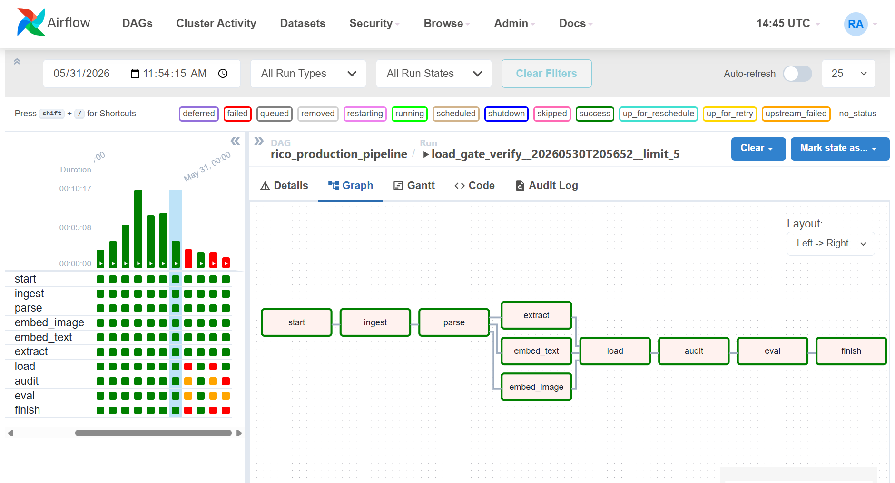
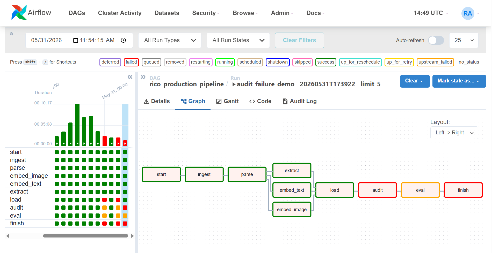
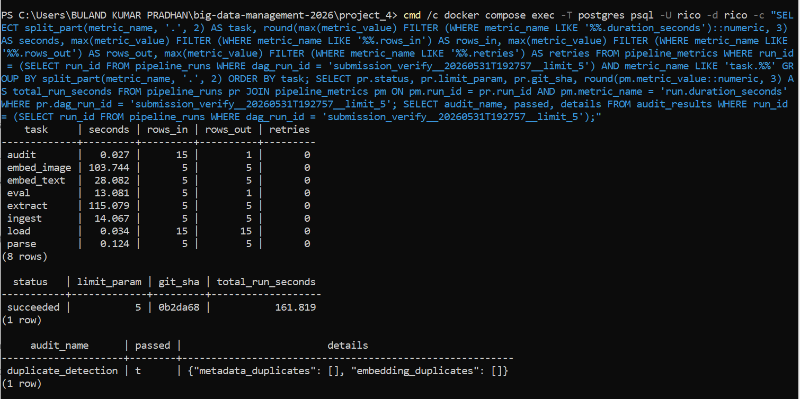
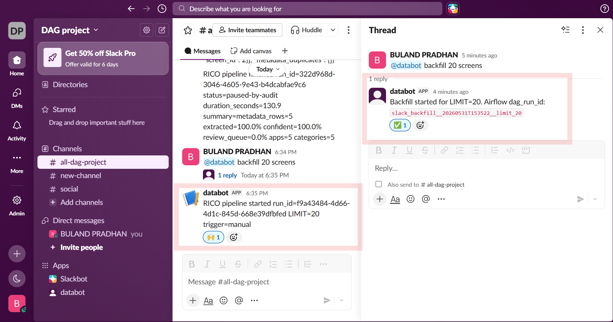

# Project 4 Report - Production RICO Airflow Pipeline

## 1. Objective

This project converts the Week 7 RICO notebook into a production-style Airflow pipeline while preserving the Week 7 modules and infrastructure pattern:

```text
ingest -> parse -> [embed_image, embed_text, extract] -> load -> audit -> eval
```

The visible `start` and `finish` tasks are operational wrappers for run tracking, metrics, and Slack notifications. The business logic remains in `src/rico_pipeline`; the DAG file only defines orchestration.

## 2. Main Concepts

- Airflow orchestrates task order, parallel execution, logs, and visible run state.
- MinIO stores raw PNG screenshots and hierarchy JSON blobs.
- Postgres + pgvector stores metadata, embeddings, review-queue rows, eval rows, audit results, run traceability, and persisted metrics.
- CLIP uses `open-clip ViT-B-32 laion2b_s34b_b79k` for 512-dimensional image vectors.
- SBERT uses `sentence-transformers/all-MiniLM-L6-v2` for 384-dimensional text vectors.
- Ollama uses `qwen2.5:3b` and the local versioned `v1` prompt for structured extraction.
- Idempotent upserts prevent duplicate destination rows when the same screens are processed again.
- Every destination row includes `run_id` and `source_fingerprint`.
- The post-load duplicate audit is a circuit breaker: it persists the result, logs full duplicate keys, stops eval, and marks the run `paused-by-audit`.
- `pipeline_metrics` persists task duration, rows in/out, retries, total run duration, and destination quality metrics.
- Slack webhook failures are warning-only, so notification issues do not fail the data pipeline.

## 3. Verified Runs

### Pushed-Code Submission Run

```text
submission_verify__20260531T192757__limit_5
```

- Airflow state: `success`
- `pipeline_runs.status`: `succeeded`
- `limit_param`: `5`
- `git_sha`: `0b2da68`
- Total duration: `161.819` seconds
- Duplicate audit: passed
- All required processing tasks persisted duration, rows in/out, and retry count.

### Audit Circuit-Breaker Run

```text
slack_audit_failure_demo__20260531T182418__limit_5
```

A controlled duplicate SBERT text embedding for `screen_id=2` was inserted. The audit found the full key:

```text
(screen_id=2,
 model_name=sentence-transformers,
 model_version=sentence-transformers/all-MiniLM-L6-v2,
 embedding_kind=text,
 count=2)
```

Observed result:

- `pipeline_runs.status`: `paused-by-audit`
- `audit_results.passed`: `false`
- `audit` task: failed
- `eval`: skipped through upstream failure
- Slack message: included run ID, duplicate key details, and Airflow audit task-log URL
- Cleanup: the controlled duplicate was removed after the demo

### Bonus Slack Backfill Run

```text
slack_backfill__20260531T153522__limit_20
```

- Slack command: `@databot backfill 20 screens`
- Agent reply: threaded confirmation with generated Airflow `dag_run_id`
- Airflow state: `success`
- `pipeline_runs.status`: `succeeded`
- `limit_param`: `20`
- Total duration: `348.438199` seconds
- Audit: passed with empty duplicate lists
- Summary: `metadata_rows=20 extracted=100.0% confident=100.0% review_queue=0.0% apps=6 categories=6`

## 4. Screenshot Guide

The screenshots are stored in [`images/`](images/). Show them in this order during evaluation.

| File | Show This | Grading Point |
| --- | --- | --- |
| `01_airflow_success.png` | Full green DAG graph | Required DAG order and successful run |
| `02_airflow_audit_failure.png` | Red `audit`, skipped/upstream-failed `eval` | Audit is a real circuit breaker |
| `03_sql_success_summary.png` | Run trace, summary, passed audit, recall@5 | Traceability, summary metrics, persisted audit, eval |
| `04_sql_traceability_idempotency.png` | Traceable destination counts and zero duplicate keys | `run_id`, `source_fingerprint`, idempotency |
| `05_sql_audit_failure.png` | `paused-by-audit`, duplicate key JSON, zero eval rows | Persisted audit-failure evidence |
| `06_slack_webhook_configured.png` | Webhook verification message | Slack webhook configuration works |
| `07_slack_run_started.png` | Start alert with run ID and `LIMIT=5` | Required start notification |
| `08_slack_run_finished.png` | Finish alert with status, duration, and summary | Required finish notification |
| `09_slack_audit_failed.png` | Audit alert with full key and Airflow task-log URL | Required audit-failed notification |
| `10_minio_raw_objects.png` | `rico-raw/screens` with PNG and JSON objects | MinIO raw storage |
| `11_bonus_slack_backfill.png` | Mention, thread reply, generated DAG run ID, `LIMIT=20` start alert | Bonus end-to-end ChatOps path |
| `12_sql_quality_metrics.png` | Quality metric rows | Vector dimensions, zero vectors, extraction, confidence, review queue, packages, categories |
| `13_sql_task_health_metrics.png` | All task metrics, final status, exact Git SHA, audit pass | Per-task health, total duration, retries, traceability |

## 5. Key Evidence Preview

Successful required DAG:



Audit circuit breaker:



Detailed persisted task-health metrics:



Bonus Slack backfill agent:



## 6. What To Say During The Main Demo

Use this short explanation:

> The main project productionizes the Week 7 RICO notebook in Airflow. The required tasks are visible in the graph, and the three expensive middle tasks run in parallel. Each Airflow execution receives a UUID `run_id`; each destination row stores that `run_id` and a `source_fingerprint`. Natural-key upserts make reruns idempotent. After load validation, the audit checks duplicate metadata IDs and duplicate embedding keys. A failed audit persists the duplicate details, marks the run `paused-by-audit`, sends the Slack alert, and prevents eval. The final task persists health and quality metrics and sends the concise finish notification.

When showing `13_sql_task_health_metrics.png`, point out that the `audit` row is included with the other required processing tasks and that the running commit is `0b2da68`.

## 7. Bonus Design

The optional bonus is kept separate from the core pipeline:

```text
bonus_backfill_agent/agent.py
```

It is an external Slack Socket Mode service using `slack_bolt`. The flow is:

```text
Slack app mention
    -> Ollama intent and LIMIT extraction
    -> validated LIMIT
    -> authenticated Airflow REST POST
    -> Airflow DAG run
    -> Slack thread reply with dag_run_id
```

The agent calls:

```text
POST /api/v1/dags/rico_production_pipeline/dagRuns
```

Slack does not execute the pipeline directly. Airflow remains the orchestrator, so bonus-triggered runs receive the same traceability, audits, metrics, and notifications as manual runs.

## 8. What To Say During The Bonus Video

1. Show the Slack channel and mention the bot: `@databot backfill 20 screens`.
2. Open the thread reply and point out the generated `slack_backfill__...__limit_20` Airflow run ID.
3. Explain that Ollama parsed the intent and requested limit.
4. Explain that the external agent validated the limit and used authenticated Airflow REST API access.
5. Open Airflow and show the new run.
6. Show SQL proof that the run finished with `limit_param=20` and passed the duplicate audit.

The recorded submission file is kept outside Git:

```text
agent backfills recording.mp4
```

## 9. Reproduction Commands

Start the stack:

```bash
cd Project_4
make up
make pull-models
```

Trigger the development run:

```bash
make trigger
```

Start the optional bonus agent after configuring Slack tokens in `.env`:

```bash
docker compose --profile agent up -d backfill-agent
```

Run tests:

```bash
docker compose exec -T airflow-scheduler python -m pytest /opt/airflow/tests
docker compose exec -T airflow-scheduler airflow dags list-import-errors
```

Expected result:

```text
11 passed
No data found
```

## 10. Submission Checklist

- Submit the GitHub branch link:
  - <https://github.com/Jojacobk/BDM-Project/tree/Buland_project_4>
- Include the separately uploaded bonus video.
- Do not commit `.env`, Slack tokens, or the Slack webhook URL.
- Do not commit after the instructor deadline.
- Use the numbered screenshots when explaining the project.
