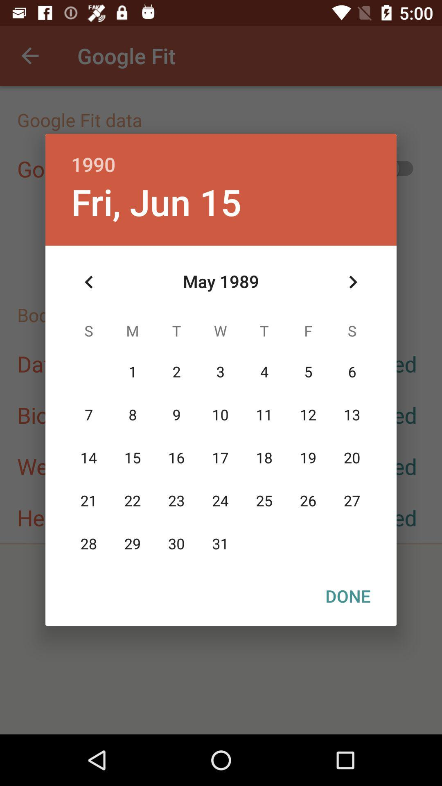
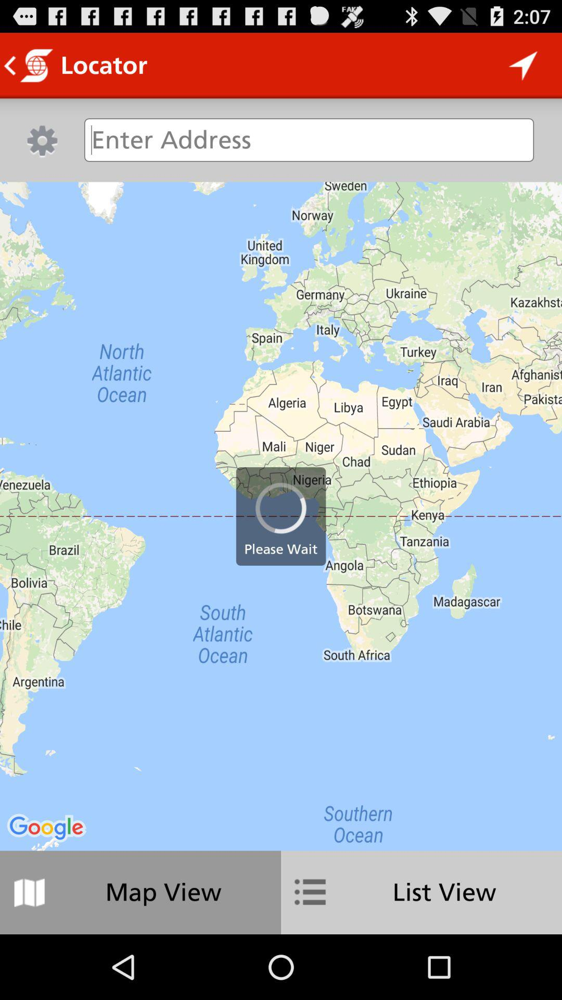
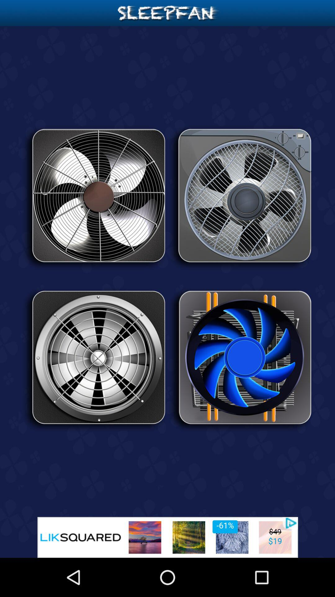
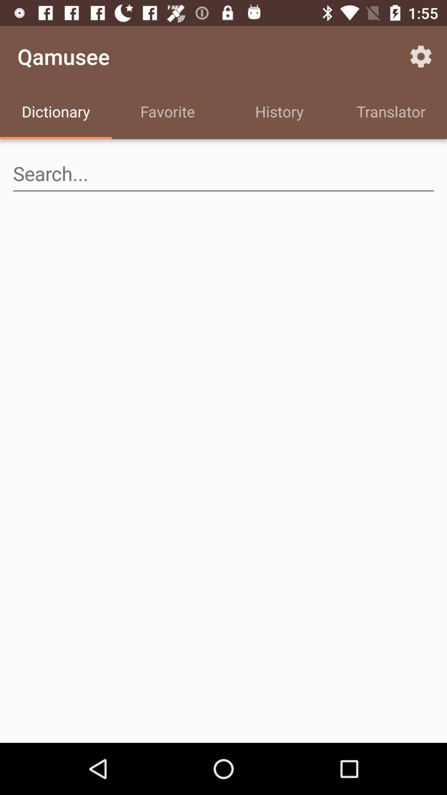
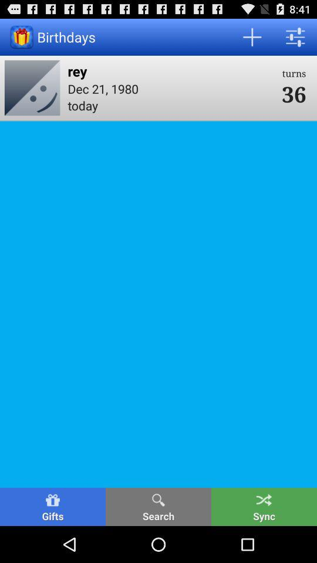

# RICO Production Pipeline — Report

Re-implementation of the lab RICO notebook as a production Apache Airflow 2.x DAG
with row-level traceability, a duplicate-detection audit that halts the run,
observability metrics, and Slack notifications.

**DAG shape:**
`start_run → ingest → parse → [embed_image, embed_text, extract] → load → audit → eval → finalize_run`
(the three middle tasks run in parallel; logic lives in `rico_pipeline/`, the DAG file is thin).

**Stack:** Postgres 16 + pgvector · MinIO (S3) · Ollama (`qwen2.5:3b`) · Airflow 2.10.5 (LocalExecutor).
Verified live end-to-end on **2026-05-31**, `LIMIT=5`, CPU-only host.

---

## Definition-of-Done scorecard

| # | Item | Status | Evidence |
|---|------|--------|----------|
| 1 | DAG appears in Airflow UI, no import errors | ✅ | §1, screenshot 1 |
| 2 | `LIMIT=5` populates all tables + `pipeline_runs` + `pipeline_metrics` | ✅ | §1–§2 |
| 3 | Re-run `LIMIT=5` → no new destination rows (idempotent) | ✅ | §3, screenshot 2 |
| 4 | Corrupt → audit fails, eval skipped, run failed | ✅ | §4, screenshot 3 |
| 5 | Every destination row has non-null `run_id` + `source_fingerprint` | ✅ | §2 |
| 6 | End-of-run one-line health + data-quality summary | ✅ | §5 |
| 7 | Slack started / finished / audit-halted; webhook not committed | ⚠️ code-verified | message built + skipped gracefully when no webhook; live posting needs a real webhook |
| 8 | README explains run / metrics / audit | ✅ | [`README.md`](README.md) |

---

## 1. The clean run (Brief §3.1, §3.2)

`LIMIT=5` run `manual__2026-05-31T09:29:06+00:00` — every task succeeded.


`pipeline_runs` row (the traceability spine):

```
run_id         | e16cb1cc-bde7-454b-829c-e9ecdaf349de
dag_run_id     | manual__2026-05-31T09:29:06+00:00
status         | succeeded
limit_param    | 5
git_sha        | 8816d915bb2c45396018a35e48d3396d5dee017f
trigger_source | manual
clip_version   | open-clip-ViT-B-32-laion2b-s34b-b79k
sbert_version  | sentence-transformers/all-MiniLM-L6-v2
llm_model      | qwen2.5:3b
prompt_version | v1
duration       | 266 s
```

## 2. Traceability + destination tables (Brief §3.2, DoD #5)

Every row in every destination table is traceable to the run that produced it and
to its source bytes:

| table | rows | run_id + source_fingerprint non-null |
|-------|------|--------------------------------------|
| `screens_metadata` | 5 | 5 / 5 |
| `screens_embeddings` | 10 (5 image @512d, 5 text @384d) | 10 / 10 |
| `screens_review_queue` | 1 | 1 / 1 |

Extraction quality: 4/5 screens produced a valid JSON `extraction_payload`
(the 5th's LLM output was invalid JSON and was correctly routed to
`screens_review_queue`); 4/5 had `confidence ≥ 0.5`.

### Source blobs in MinIO (`rico-raw/screens/`)

10 objects (one `.png` + one `.json` per screen). The five stored screen images:

| screen 2 | screen 26 | screen 37 | screen 41 | screen 50 |
|---|---|---|---|---|
|  |  |  |  |  |

## 3. Idempotency (Brief §3.1, DoD #3)

Re-triggering `LIMIT=5` (run `manual__2026-05-31T09:37:37+00:00`) succeeded and added
**no new destination rows**:

| table | before | after |
|-------|--------|-------|
| `screens_metadata` | 5 | 5 (5 distinct `screen_id`) |
| `screens_embeddings` | 10 | 10 (10 distinct natural keys) |
| `screens_review_queue` | 1 | 1 |
| `pipeline_runs` | 1 | 2 *(append-only run ledger — correct)* |

Idempotency comes from guarded `INSERT … WHERE NOT EXISTS` on the natural keys.


## 4. The audit as a circuit breaker (Brief §3.3)

`make corrupt` injected a duplicate `screen_id 2 / text` embedding, then a re-run
(`manual__2026-05-31T09:44:43+00:00`) was halted by the audit:

- `audit` task **failed loudly**, `eval` **skipped** (`upstream_failed`), `finalize_run` failed → **Airflow run = failed**
- `pipeline_runs.status = paused_by_audit`
- no `screens_eval` row written for the halted run


`audit_results` logs the exact duplicate key for a human to investigate:

```
audit_name | duplicate_detection
passed     | f
details    | {"embedding_duplicates": [{"screen_id": 2,
              "model_name": "sentence-transformers",
              "model_version": "sentence-transformers/all-MiniLM-L6-v2",
              "embedding_kind": "text", "count": 2}],
              "metadata_duplicates": []}
```

## 5. Observability (Brief §3.4)

Per-task health metrics (clean run): duration, retries, and rows-written recorded
for every task — `extract` 213.8 s, `embed_image` 61.1 s, `embed_text` 33.2 s,
`ingest` 27.5 s, `eval` 13.7 s; retries=0 across the board.

Run-level data-quality metrics: `extracted_pct=80`, `confidence_ge_05_pct=80`,
`review_queue_count=1`, `zero_norm_pct=0`, `total_run_duration_seconds≈350`,
`final_status=succeeded`. All persisted in `pipeline_metrics` keyed by `run_id`.

One-line summary logged by `finalize_run` (DoD #6):

```
SUMMARY run=e16cb1cc-… status=succeeded dur=350.0s | meta=5 (extracted 80%, conf>=.5 80%, review=1) | emb image=5/512d text=5/384d zero=0% | apps=5 cats=5
```
