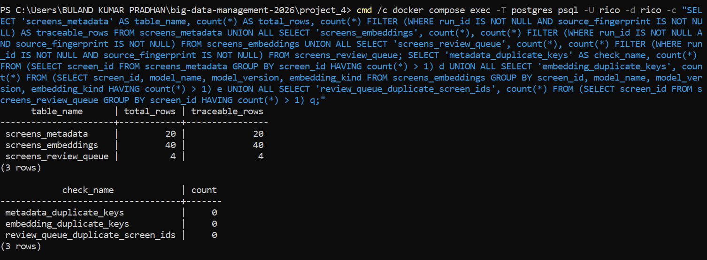
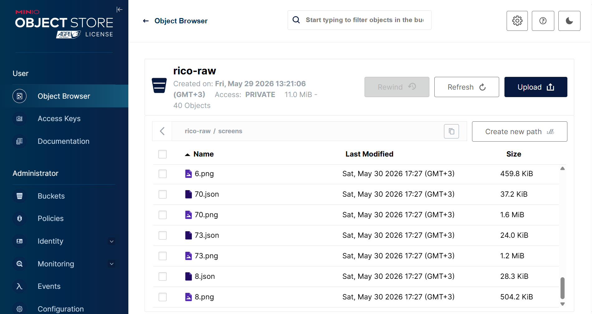
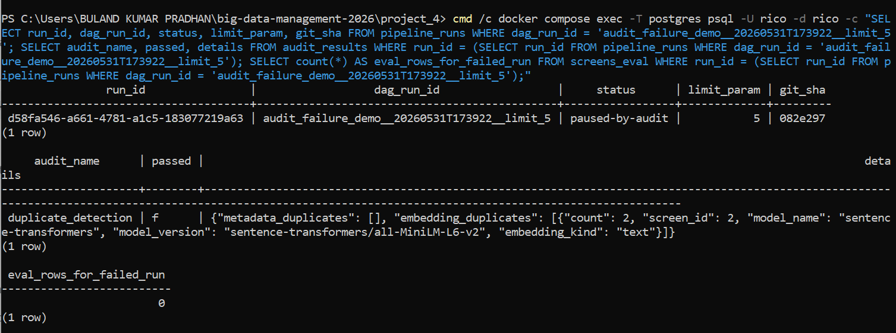
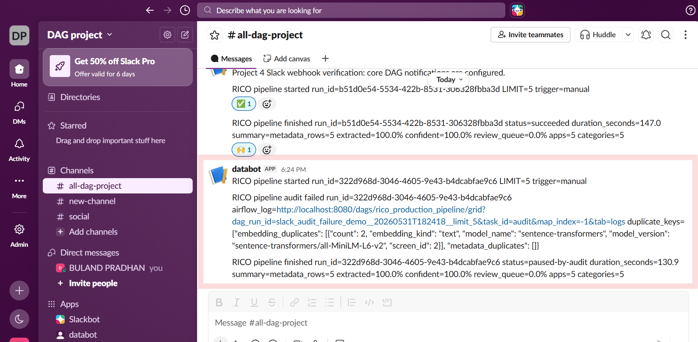
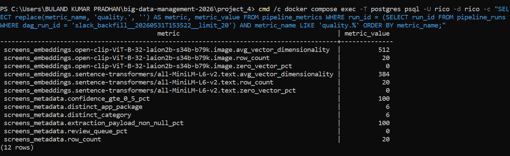
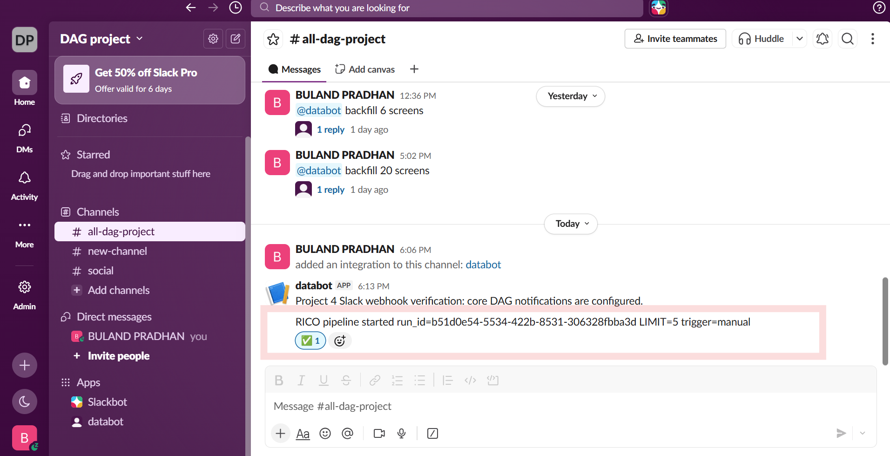
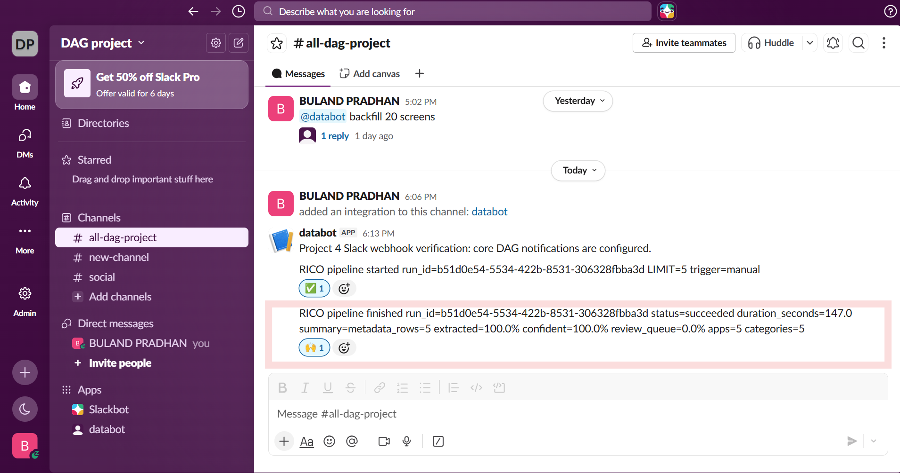

# Project 4 Results Report

## 1. Summary

The Week 7 RICO notebook was reimplemented as a production-style Airflow DAG:

```text
ingest -> parse -> [embed_image, embed_text, extract] -> load -> audit -> eval
```

The implementation uses the same Week 7 data, models, MinIO object storage, Postgres + pgvector database, and Ollama endpoint. The pipeline adds the production requirements from the Project 4 brief: idempotency, row-level traceability, a real duplicate-detection circuit breaker, persisted observability metrics, and Slack notifications.

The optional bonus is implemented separately as a Slack Socket Mode backfill agent. It accepts a natural-language mention, uses Ollama to extract intent and `LIMIT`, triggers Airflow through the authenticated REST API, and replies in the Slack thread.

## 2. What Was Implemented

### Required Airflow Pipeline

- Thin Airflow DAG in `dags/rico_production_pipeline.py`
- Parallel `embed_image`, `embed_text`, and `extract` tasks
- Dynamic `LIMIT` configuration
- Idempotent Postgres writes and deterministic MinIO object keys
- Load completeness gate before audit and eval
- Self-test recall@5 eval, which the brief explicitly permits

### Traceability

- `pipeline_runs` records UUID `run_id`, Airflow `dag_run_id`, timestamps, final status, `LIMIT`, Git SHA, CLIP version, SBERT version, LLM model, and prompt version.
- `screens_metadata`, `screens_embeddings`, and `screens_review_queue` store non-null `run_id` and `source_fingerprint`.
- Stage logs include `run_id` so rows, blobs, and task logs can be correlated.

### Audit

- Visible `audit` task after `load` and before `eval`
- Duplicate `screens_metadata.screen_id` check for the current run
- Duplicate embedding-key check for the current run:

```text
(screen_id, model_name, model_version, embedding_kind)
```

- Full duplicate-key details persisted in `audit_results`
- Failed audit marks the run `paused-by-audit`, sends Slack details, and prevents eval

### Observability

- Per-task duration
- Per-task rows in and rows out
- Per-task retry count
- Total run duration
- Persisted final `run.status`
- One-line `run.summary`
- Metadata extraction, confidence, and review-queue percentages
- Embedding row counts, model versions, kinds, average dimensions, and zero-vector percentages
- Distinct package and category counts

### Slack

- Start notification with `run_id`, `LIMIT`, and trigger type
- Audit-failed notification with full duplicate keys and Airflow task-log URL
- Finish notification with final status, duration, and summary
- Warning-only behavior when Slack is missing or unavailable

## 3. Final Required-Pipeline Verification

The final verification ran on May 31, 2026 with pushed code revision:

```text
7ed0765
```

Final DAG run:

```text
final_submission_verify__20260531T195333__limit_5
```

### Run Traceability Result

| Field | Value |
| --- | --- |
| `run_id` | `fb2e3d07-8baa-4db0-ae95-23608239a4f8` |
| `status` | `succeeded` |
| `limit_param` | `5` |
| `git_sha` | `7ed0765` |
| CLIP version | `open-clip-ViT-B-32-laion2b-s34b-b79k` |
| SBERT version | `sentence-transformers/all-MiniLM-L6-v2` |
| LLM model | `qwen2.5:3b` |
| Prompt version | `v1` |

### Final Health Metrics

| Metric | Value |
| --- | --- |
| `run.duration_seconds` | `140.742205` |
| `run.status` | `succeeded` |
| `run.summary` | `metadata_rows=5 extracted=100.0% confident=80.0% review_queue=0.0% apps=5 categories=5` |

### Per-Task Health Metrics

| Task | Duration (s) | Rows In | Rows Out | Retries |
| --- | ---: | ---: | ---: | ---: |
| `audit` | `0.031` | `15` | `1` | `0` |
| `embed_image` | `93.302` | `5` | `5` | `0` |
| `embed_text` | `48.915` | `5` | `5` | `0` |
| `eval` | `14.184` | `5` | `1` | `0` |
| `extract` | `91.675` | `5` | `5` | `0` |
| `ingest` | `13.349` | `5` | `5` | `0` |
| `load` | `0.027` | `15` | `15` | `0` |
| `parse` | `0.158` | `5` | `5` | `0` |

### Audit And Eval Results

| Result | Value |
| --- | --- |
| Audit name | `duplicate_detection` |
| Audit passed | `true` |
| Metadata duplicates | `[]` |
| Embedding duplicates | `[]` |
| Eval model | `sentence-transformers/all-MiniLM-L6-v2` |
| Eval queries | `5` |
| Recall@5 | `1` |

## 4. Idempotency And Destination Traceability

Screenshot `04_sql_traceability_idempotency.png` captured this traceable destination state after repeated runs:

| Table | Total Rows | Rows With Non-Null `run_id` And `source_fingerprint` |
| --- | ---: | ---: |
| `screens_metadata` | `20` | `20` |
| `screens_embeddings` | `40` | `40` |
| `screens_review_queue` | `4` | `4` |

The review queue is an idempotent current-state table keyed by `screen_id`. Failed extraction creates or updates a queue row, while a later successful extraction removes the resolved row. A later final clean database check returned `0` review-queue rows after successful re-extraction. Both observations are consistent with the implemented queue lifecycle.

Duplicate-key checks:

| Check | Duplicate Count |
| --- | ---: |
| Metadata `screen_id` keys | `0` |
| Embedding natural keys | `0` |
| Review-queue `screen_id` keys | `0` |

MinIO contained `40` objects for the 20-screen processed state: one PNG and one hierarchy JSON object per screen.





## 5. Audit Circuit-Breaker Verification

A controlled duplicate SBERT text embedding was manually inserted for `screen_id=2`. The re-run was:

```text
slack_audit_failure_demo__20260531T182418__limit_5
```

Observed result:

| Check | Result |
| --- | --- |
| Pipeline status | `paused-by-audit` |
| Audit task | failed loudly |
| Eval task | skipped through upstream failure |
| Eval rows for failed run | `0` |
| `audit_results.passed` | `false` |
| Duplicate key logged | full SBERT text key for `screen_id=2`, count `2` |
| Slack alert | included run ID, duplicate keys, and Airflow task-log URL |
| Cleanup | controlled duplicate removed after demo |






## 6. Ordinary Failed-Run Verification

The brief distinguishes an ordinary failed run from an audit-halted run. A safe controlled failure was triggered with `LIMIT=0`:

```text
generic_failure_demo__20260531T195915__limit_0
```

The load completeness gate rejected the empty result without modifying destination data.

| Check | Result |
| --- | --- |
| Pipeline status | `failed` |
| Persisted `run.status` metric | `failed` |
| Total duration | `31.624273` seconds |
| `load` task | failed with `metadata_count=0` |
| `audit` task | skipped through upstream failure |
| `eval` task | skipped through upstream failure |
| Finish notification | attempted with final `status=failed` |

This verifies the ordinary failure route separately from the `paused-by-audit` route.

## 7. Destination-Quality Metrics

The verified `LIMIT=20` run produced:

| Metric | Value |
| --- | ---: |
| CLIP image rows | `20` |
| CLIP average dimensionality | `512` |
| CLIP zero-vector percentage | `0` |
| SBERT text rows | `20` |
| SBERT average dimensionality | `384` |
| SBERT zero-vector percentage | `0` |
| Metadata extraction payload percentage | `100` |
| Metadata confidence `>= 0.5` percentage | `100` |
| Review-queue percentage | `0` |
| Distinct application packages | `6` |
| Distinct categories | `6` |



## 8. Slack Notification Verification

The required webhook messages were verified:

| Notification | Verified Content |
| --- | --- |
| Run started | `run_id`, `LIMIT`, trigger type |
| Run finished | final status, total duration, one-line summary |
| Audit failed | `run_id`, full duplicate keys, Airflow task-log URL |

The finish-notification implementation also executed for the controlled ordinary failed run with `status=failed`.





## 9. Bonus Backfill Agent Result

The bonus implementation is separate from the main pipeline:

```text
bonus_backfill_agent/agent.py
```

Verified live flow:

```text
Slack mention
  -> Ollama intent and LIMIT parser
  -> validated LIMIT
  -> authenticated Airflow REST POST
  -> new Airflow DAG run
  -> Slack thread confirmation with dag_run_id
```

Live Slack message:

```text
@databot backfill 20 screens
```

Generated run:

```text
slack_backfill__20260531T153522__limit_20
```

Verified result:

| Field | Value |
| --- | --- |
| Airflow state | `success` |
| `pipeline_runs.status` | `succeeded` |
| `pipeline_runs.limit_param` | `20` |
| Audit | passed with empty duplicate lists |
| Total duration | `348.438199` seconds |
| Summary | `metadata_rows=20 extracted=100.0% confident=100.0% review_queue=0.0% apps=6 categories=6` |


The required bonus demonstration video is included in the repository:

[`bonus_video/agent_backfills_recording.mp4`](bonus_video/agent_backfills_recording.mp4)

## 10. Definition Of Done Verification

| Instructor Requirement | Status | Evidence |
| --- | --- | --- |
| `make up` starts infrastructure and DAG imports | Complete | Docker validation and no DAG import errors |
| `LIMIT=5` populates destinations, `pipeline_runs`, and `pipeline_metrics` | Complete | Final verification run |
| Same `LIMIT` rerun does not create duplicate destination rows | Complete | Zero duplicate checks and stable destination counts |
| Manual embedding corruption fails audit and skips eval | Complete | Audit-failure screenshots and persisted failed audit |
| Destination rows have non-null `run_id` and `source_fingerprint` | Complete | Traceability SQL screenshot |
| End-of-run summary is concise and readable | Complete | Slack finish screenshot and persisted `run.summary` |
| Successful, failed, and audit-halted runs execute the expected Slack notification paths | Complete | Slack screenshots and controlled ordinary-failure verification |
| README explains execution, metric meanings, and audit failure | Complete | `README.md` |
| Bonus standalone agent listens to mentions and triggers dynamic `LIMIT=20` | Complete | Bonus screenshot and separate video |

## 11. Evaluation Criteria Coverage

| Weight | Criterion | Implemented Evidence |
| --- | --- | --- |
| 40% | Correctness and idempotency | Successful DAG, stable destination counts, natural-key upserts, deterministic blobs, zero duplicate checks |
| 20% | Traceability | `pipeline_runs`, Git SHA, model versions, prompt version, row `run_id`, row `source_fingerprint` |
| 20% | Audit | Visible post-load task, complete duplicate keys, failed audit record, stopped eval, Slack task-log URL |
| 15% | Observability | Persisted task health, total duration, final status, summary, and destination-quality metrics |
| 5% | Code quality and README | Thin DAG, separate modules, Docker setup, reproducible README, separate bonus service |

## 12. Screenshot Index

| Screenshot | Evidence |
| --- | --- |
| [`01_airflow_success.png`](images/01_airflow_success.png) | Successful required DAG graph |
| [`02_airflow_audit_failure.png`](images/02_airflow_audit_failure.png) | Audit halt before eval |
| [`03_sql_success_summary.png`](images/03_sql_success_summary.png) | Successful summary, passed audit, and recall@5 |
| [`04_sql_traceability_idempotency.png`](images/04_sql_traceability_idempotency.png) | Destination traceability and zero duplicate keys |
| [`05_sql_audit_failure.png`](images/05_sql_audit_failure.png) | Persisted audit halt and zero eval rows |
| [`06_slack_webhook_configured.png`](images/06_slack_webhook_configured.png) | Slack webhook verification |
| [`07_slack_run_started.png`](images/07_slack_run_started.png) | Start alert |
| [`08_slack_run_finished.png`](images/08_slack_run_finished.png) | Finish alert |
| [`09_slack_audit_failed.png`](images/09_slack_audit_failed.png) | Audit-failed alert with Airflow task-log URL |
| [`10_minio_raw_objects.png`](images/10_minio_raw_objects.png) | MinIO raw-object storage |
| [`11_bonus_slack_backfill.png`](images/11_bonus_slack_backfill.png) | Bonus mention and threaded confirmation |
| [`12_sql_quality_metrics.png`](images/12_sql_quality_metrics.png) | Destination-quality metrics |
| [`13_sql_task_health_metrics.png`](images/13_sql_task_health_metrics.png) | Per-task health metrics from the prior pushed-code verification run |

## 13. Validation Results

The final checks passed:

```text
11 passed
No data found
```

## 14. Repository Artifacts

| Artifact | Location |
| --- | --- |
| Project documentation | [`README.md`](README.md) |
| Results report | [`REPORT.md`](REPORT.md) |
| Screenshot evidence | [`images/`](images/) |
| Bonus service | [`bonus_backfill_agent/`](bonus_backfill_agent/) |
| Bonus demonstration video | [`bonus_video/agent_backfills_recording.mp4`](bonus_video/agent_backfills_recording.mp4) |
